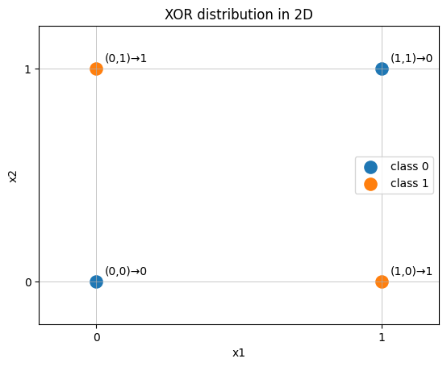

## 感知机

## 1. 感知机是什么？它和神经元的关系？

**Q：如果激活函数取硬阈值 step，会怎样？**

感知机就是“神经元 + 硬阈值激活”，输出 $0/1$：
$$
\hat y = \text{step}(w^\top x + b)=
\begin{cases}
1, & w^\top x+b \ge 0 \\\\
0, & w^\top x+b < 0
\end{cases}
$$

结论：**感知机是神经元的一个特例**（$\sigma$ 取 step）。

---

## 2. 感知机的能力与限制（为什么 XOR 做不了？）

**Q：感知机的决策边界是什么形状？**

它的边界是：

$$
w^\top x + b = 0
$$

也就是画一条直线（二维）/超平面（高维）分开两类，因此它只能解决**线性可分**问题。

**Q：经典例子XOR **

四个点如下（二维）：

- (0,0) → 0

- (1,1) → 0

- (0,1) → 1

- (1,0) → 1

  

  这四点分别属于两个类别，呈现出“对角交错”形态，**怎么画一条直线都无法把 1 和 0 完全分开**。

  