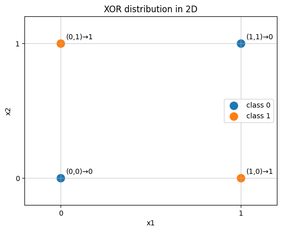
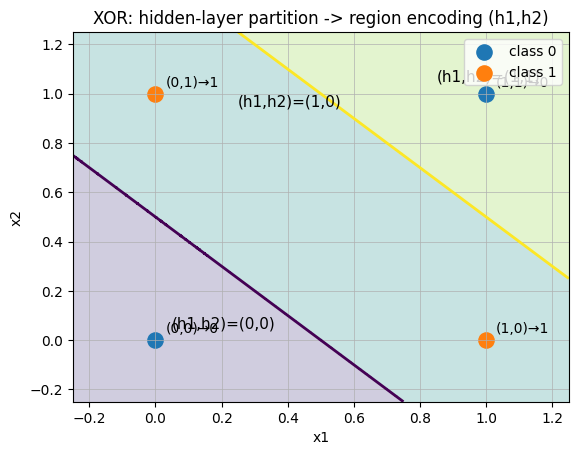

# 感知机—神经元—神经网络

## 1. 神经元是什么？
**Q：最小的可学习单元是什么？**

神经元先给输入打分，再用激活函数做一次非线性变换：

$$
z = w^\top x + b
$$

$$
a = \sigma(z)
$$

$x$：输入特征向量  

$w$：权重（每个特征的重要性）  

$b$：偏置（阈值/平移项）  

$\sigma(\cdot)$：激活函数（引入非线性）

 **Q：为什么不直接使用$w^\top x + b$作为输出而是多一个激活函数？**

假设你有两层：
$$
h=W_1​x+b_1​,y^​=W_2​h+b_2​
$$
把它合并：
$$
\hat y ​=W_2​(W_1​x+b_1​)+b_2​=(W_2​W_1​)x+(W_2​b_1​+b_2​)
$$
**结论：多层线性=单层线性，表达能力并不会有任何提升。**

**Q：常见激活函数的输出形式？**

二分类希望输出像概率的数，选择Sigmoid（Logistic）函数

**定义**
$$
\sigma(z) = \frac{1}{1+e^{-z}}
$$

**输出范围**

$$
\sigma(z)\in(0,1)
$$

**作用**
- 把任意实数压缩到 (0,1)，便于解释为“概率”
- 常用于二分类输出层

---

多分类希望输出一组概率，选择 Softmax函数

**定义（对向量 $z\in \mathbb{R}^K$）**

$$
\text{softmax}(z_i)=\frac{e^{z_i}}{\sum_{j=1}^K e^{z_j}}
$$

**输出性质**

$$
\sum_{i=1}^K \text{softmax}(z_i)=1
$$

**作用**
- 把 $K$ 维打分变成概率分布
- 多分类输出层标准选择

---

**结论**：激活函数**引入非线性**，让多层网络表达能力增强；控制输出范围。

---

## 2. 感知机是什么？它和神经元的关系？

**Q：如果激活函数取硬阈值 step，会怎样？**

感知机就是“神经元 + 硬阈值激活”，输出 $0/1$：
$$
\hat y = \text{step}(w^\top x + b)=
\begin{cases}
1, & w^\top x+b \ge 0 \\\\
0, & w^\top x+b < 0
\end{cases}
$$

结论：**感知机是神经元的一个特例**（$\sigma$ 取 step）。

---

## 3. 感知机的能力与限制（为什么 XOR 做不了？）
**Q：感知机的决策边界是什么形状？**

它的边界是：

$$
w^\top x + b = 0
$$

也就是画一条直线（二维）/超平面（高维）分开两类，因此它只能解决**线性可分**问题。

**Q：经典例子XOR **

四个点如下（二维）：

- (0,0) → 0

- (1,1) → 0

- (0,1) → 1

- (1,0) → 1

  

  这四点分别属于两个类别，呈现出“对角交错”形态，**怎么画一条直线都无法把 1 和 0 完全分开**。

  

---

## 4. 神经网络是什么？为什么“多层 + 非线性”会更强？

**Q: 两层网络结构（2 个隐藏单元 + 1 个输出单元）是如何解决XOR问题的？**

 隐藏层：构造两个“中间特征”

**隐藏单元 1：实现 OR（至少一个为 1）**
$$
h_1=\mathrm{step}(x_1+x_2-0.5)
$$

解释：  

- (0,0) 时，$x_1+x_2=0$，$0-0.5<0$，输出 0  
- 只要有一个 1，$x_1+x_2\ge 1$，$1-0.5\ge 0$，输出 1  

因此：

$$
h_1 = x_1 \lor x_2
$$

**隐藏单元 2：实现 AND（两个都为 1）**

$$
h_2=\mathrm{step}(x_1+x_2-1.5)
$$

解释：  

- 只有 (1,1) 时，$x_1+x_2=2$，$2-1.5\ge 0$，输出 1  
- 其余情况 $x_1+x_2\le 1$，$1-1.5<0$，输出 0  

因此：

$$
h_2 = x_1 \land x_2
$$

---

输出层：把中间特征组合成 XOR

我们要的逻辑是：

$$
\mathrm{XOR} = (x_1\lor x_2)\land \neg(x_1\land x_2)
$$

用 $h_1,h_2$ 表示，就是：

$$
\mathrm{XOR} = h_1 \land \neg h_2
$$

用一个 step 神经元实现“只在 $(h_1,h_2)=(1,0)$ 时输出 1”：

$$
\hat y=\mathrm{step}(h_1-h_2-0.5)
$$

---

### 4.1 手算四个输入：逐层算到输出（对齐 XOR 真值表）

####  输入 (0,0)

$$
h_1=\mathrm{step}(0+0-0.5)=\mathrm{step}(-0.5)=0
$$

$$
h_2=\mathrm{step}(0+0-1.5)=\mathrm{step}(-1.5)=0
$$

$$
\hat y=\mathrm{step}(0-0-0.5)=\mathrm{step}(-0.5)=0
$$

结论：$(0,0)\to 0$

---

####  输入 (0,1)

$$
h_1=\mathrm{step}(0+1-0.5)=\mathrm{step}(0.5)=1
$$

$$
h_2=\mathrm{step}(0+1-1.5)=\mathrm{step}(-0.5)=0
$$

$$
\hat y=\mathrm{step}(1-0-0.5)=\mathrm{step}(0.5)=1
$$

结论：$(0,1)\to 1$

---

#### 输入 (1,0)

$$
h_1=\mathrm{step}(1+0-0.5)=\mathrm{step}(0.5)=1
$$

$$
h_2=\mathrm{step}(1+0-1.5)=\mathrm{step}(-0.5)=0
$$

$$
\hat y=\mathrm{step}(1-0-0.5)=\mathrm{step}(0.5)=1
$$

结论：$(1,0)\to 1$

---

#### 输入 (1,1)

$$
h_1=\mathrm{step}(1+1-0.5)=\mathrm{step}(1.5)=1
$$

$$
h_2=\mathrm{step}(1+1-1.5)=\mathrm{step}(0.5)=1
$$

$$
\hat y=\mathrm{step}(1-1-0.5)=\mathrm{step}(-0.5)=0
$$

结论：$(1,1)\to 0$

---

## 5.总结

Q：神经元按层连接依靠非线性激活函数具体都做了什么？（以XOR为例）

### 5.1 隐藏层在输入空间里做了两次线性切分

隐藏单元 1 的分界线（使其输出从 0 变 1 的位置）来自：

$$
x_1+x_2-0.5=0
$$

即：

$$
x_1+x_2=0.5
$$

隐藏单元 2 的分界线来自：

$$
x_1+x_2-1.5=0
$$

即：

$$
x_1+x_2=1.5
$$

这两条直线把平面按 $x_1+x_2$ 的大小分成三块区域：

1) $x_1+x_2<0.5$  
2) $0.5\le x_1+x_2<1.5$  
3) $x_1+x_2\ge 1.5$  

---

### 5.2 每个区域会被隐藏层“编码”为 (h1,h2)

根据 $h_1,h_2$ 的定义：

- 当 $x_1+x_2<0.5$时：
  
  $ h_1=0,\ h_2=0 $

  即编码为 $(h_1,h_2)=(0,0)$
  
- 当 $0.5\le x_1+x_2<1.5$ 时：
  
  $h_1=1,\ h_2=0$

  即编码为 $(h_1,h_2)=(1,0)$
  
- 当 $x_1+x_2\ge 1.5$ 时：
  
  $h_1=1,\ h_2=1$
  
  即编码为 $(h_1,h_2)=(1,1)$

因此，隐藏层把连续空间“切块”后，把每一块变成离散的符号编码 $(h_1,h_2)$。

---

### 5.3 输出层做“组合”：只选择编码 (1,0) 作为正类

输出层：

$$
\hat y=\mathrm{step}(h_1-h_2-0.5)
$$

检查三种编码：

- 若 $(h_1,h_2)=(0,0)$
  
  $h_1-h_2-0.5=-0.5<0 \Rightarrow \hat y=0$
  
  
  
- 若 $(h_1,h_2)=(1,0)$ 
  

  $h_1-h_2-0.5=0.5\ge 0 \Rightarrow \hat y=1$
  
  
  
- 若 $(h_1,h_2)=(1,1)$  
  
  
  
  $h_1-h_2-0.5=-0.5<0 \Rightarrow \hat y=0$
  
  

隐藏层用多个线性边界把输入空间切成多个区域，并通过 step 把区域变成离散编码；输出层再对这些编码做线性选择与阈值判定，从而实现单条直线无法完成的 XOR 分类。

- 神经元：$z=w^\top x+b$ 再过激活 $a=\sigma(z)$ 的基本单元  
- 感知机：激活是 step 的神经元（输出 $0/1$ 的线性分类器）  
- 神经网络：大量神经元按层连接；依靠非线性激活提升表达能力

[常见的激活函数](ActivationFunction.md)
